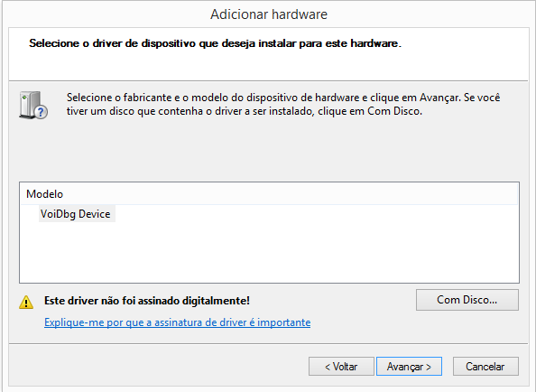
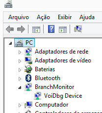
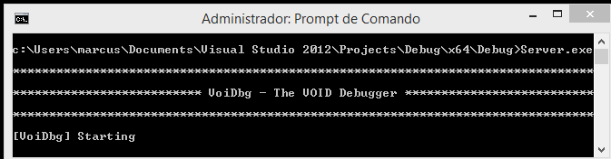
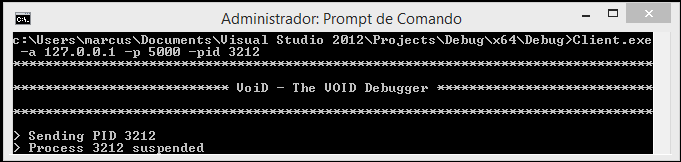

# VoiDBG: The VOID Debugger

A transparent debugger build upon Branch Monitoring framework.

## The driver

This driver is implemented in a independent way from the previously presented one. However, we opt to not implement some features, such as CPU checks. If you are interested on these, you can copy the source files and add them to this driver.

## Inverted I/O

Our inverted I/O implementation is based on [this article](https://www.osr.com/nt-insider/2013-issue1/inverted-call-model-kmdf/).

## Compiling the driver

As our driver is structured as a KMDF, you may need [WDF](https://docs.microsoft.com/en-us/windows-hardware/drivers/wdf/installation-components-for-kmdf-drivers) to compile it.

## Installing the driver

Unlike the other driver, which is a *filesystem-based driver*, the debugger is installed as a *device driver*, as shown below:

After Installed, you can see the device on *Device Manager*, as shown below:

## Running the server

When started, the server will bind to the *5000* port automatically and then wait for connections, as show below:

## Running the client

You can run the client by supping the server IP:PORT and the analyzed binary file or PID, as shown below:

