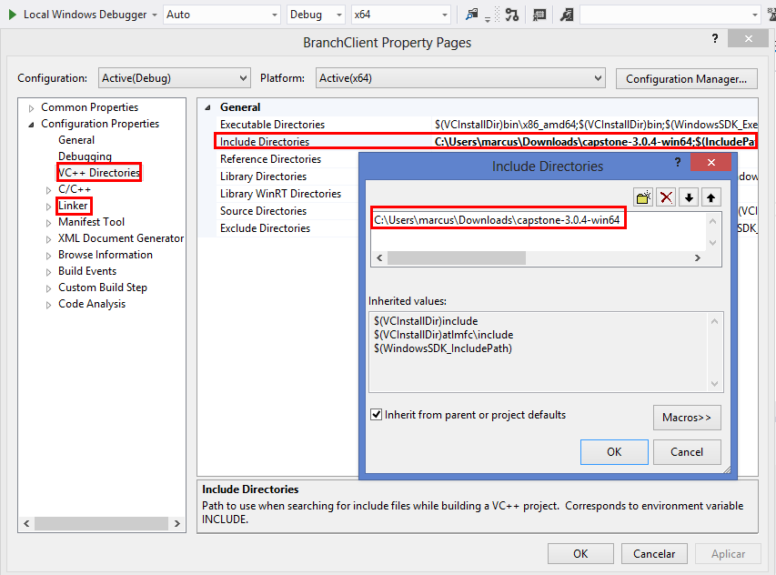
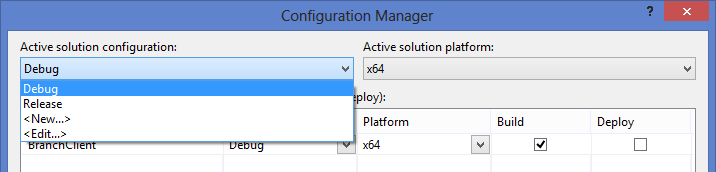
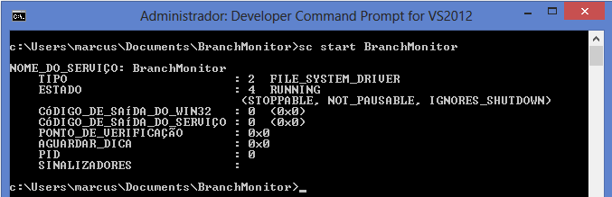
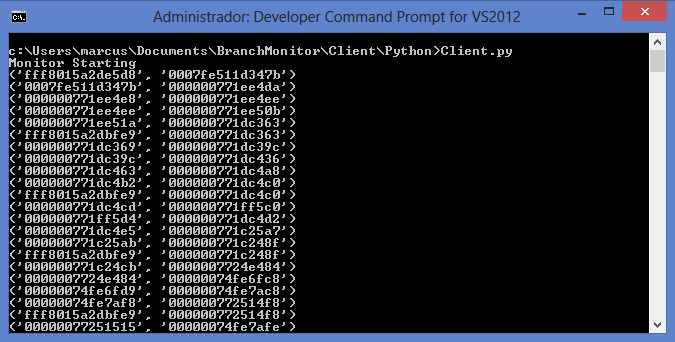
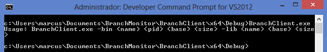
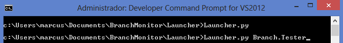
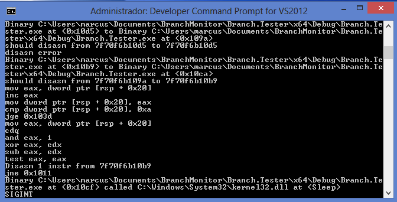
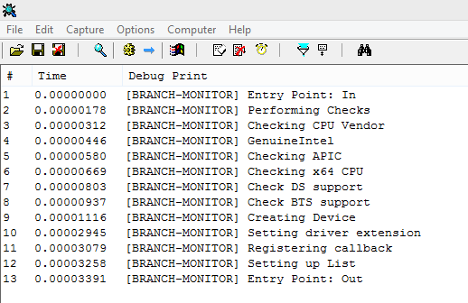

# Branch Monitoring Project

## Introduction

The Branch Monitoring Project.

### Goal
Branch Monitor is an alternative for runtime process monitoring on modern
(Windows) systems. Our approach makes use of Branch Trace Store (BTS) from
Intel's processors to implement a dynamic, transparent framework. The framework
provide many analysis facilities, such as function call tracing and Control Flow
Graph (CFG) reconstruction.

### Author

This project is part of Marcus Botacin's master work.
[Marcus](http://lasca.ic.unicamp.br/~marcus) is a Computer
Science master candidate at [Institute of Computing](http://www.ic.unicamp.br/) 
from [University of Campinas](http://www.unicamp.br/unicamp/), being advised 
by [Prof. Dr. Paulo Lício de Geus](http://www.lasca.ic.unicamp.br/paulo/) 
and [Prof. Dr. André Ricardo Abed Grégio](https://sites.google.com/site/argregio/). 
More detailed information, such as academic papers, can be found at the [project
page](https://sites.google.com/site/branchmonitoringproject/).

## Repository

From code to real world.

### Organization

The repository is organized as follows:

* **Client**: A simple polling-based driver client able to retrieve and print branch-collected data.
* **BranchClient**: An advanced driver client able to perform flow analysis and
  CG, CFG reconstruction for a given Process ID (PID). You are required to
  provide addresses for all libraries to be monitored.
* **Branch.Tester**: A loop program used for validation purposes.
* **Launcher**: A tool to ease monitoring process start up. Given a PID, dumps all
  memory address and supplies them as inputs to the advanced client.
* **BranchMonitor**: The monitoring driver.
* **DumpDLL**: A tool to ease introspection headers generation.


### Dependencies

* Compiled on [Visual Studio
  2012](https://msdn.microsoft.com/pt-br/library/dd831853%28v=vs.110%29.aspx).
* Binaries may require [MSVCR110D.dll](https://answers.microsoft.com/en-us/windows/forum/windows_8-winapps/the-program-cant-start-because-msvcr110dll-is/f052d325-3af9-4ae5-990b-b080799724db) when compiled using debugging symbols.
* The simple client requires [Python](https://www.python.org/) and
  [win32file](http://docs.activestate.com/activepython/2.6/pywin32/win32file.html).
* The advanced client requires [.Net
  framework](https://www.microsoft.com/net/download/framework).
* Code disassembly is performed by [Capstone](https://github.com/aquynh/capstone).
* Automatic launcher requires [Python](https://www.python.org/), [Sysinternals](https://technet.microsoft.com/en-us/sysinternals/bb545021.aspx), [BeautifulSoup](https://pypi.python.org/pypi/beautifulsoup4), [Codecs](https://docs.python.org/2/library/codecs.html), and [ConfigParser](https://docs.python.org/2/library/configparser.html).
* DLL dumps for *DumpDLL* are obtained using [DLL Export
  Viewer](http://www.nirsoft.net/utils/dll_export_viewer.html).

### Configuring

Some configurations, such as monitoring core, should be set on the config.h
file.

You should define wether you want debug messages to be displayed or not.
```C
#define DEBUG
```

In this case, you are also required to define the driver name printed on
debugger screen. This step is important so that you can filter driver messages
being displayed.
```C
#define DRIVER_NAME "[BRANCH-MONITOR]"
```

You also should set driver name for system and DOS subsystem. This is the name
you use to communicate using OpenFile.
```C
#define DRIVERNAME L"\\Device\\BranchMonitor"
#define DOSDRIVERNAME L"\\DosDevices\\BranchMonitor"
```

You should set on which core the monitor will be enabled.
```C
#define BTS_CORE 3
```
**Introspection Update**: As noticed by @smaresca, introspection headers are
version-dependent. The values supplied work for Windows 8 x64 6.2 build 9200. 
Some DLL versions are shown below whereas others can be found on 
[DLL.Versions](https://github.com/marcusbotacin/BranchMonitoringProject/blob/master/DumpDLL/DLL.Versions.txt).

```
ProductVersion   FileVersion      FileName                                                                             
--------------   -----------      --------                                                                             
6.2.9200.16384   6.2.9200.1638... C:\Windows\System32\ntdll.dll
6.2.9200.16384   6.2.9200.1638... C:\Windows\System32\kernel32.dll

```

In order
to run the solution on other systems, you need to dump the target DLL and generate
the header file. This process is eased by the *DumpDLL* tool, which parses DLL
dumps and produces the correct, ordered outputs, as shown below:

*NTDLL Input*:

```
==================================================
Function Name     : ZwYieldExecution
Address           : 0x0000000180003040
Relative Address  : 0x00003040
Ordinal           : 1971 (0x7b3)
Filename          : ntdll.dll
Full Path         : C:\Windows\system32\ntdll.dll
Type              : Exported Function
==================================================
```

*NTDLL Output*:
```
strcpy , 4896
strcat , 4720
memcmp , 4496
_local_unwind , 4432
RtlGetCurrentUmsThread , 4240
RtlEnterCriticalSection , 4192
RtlLeaveCriticalSection , 4112
```


### Building

In order to build the many components of our framework, you should include their
paths on the compilation project, as shown below:



In my computer, I was compiling under C:\\. If you are compiling from other dir,
you need to point /src path properly.

You should also define system architecture and configurations, as shown below:



## Running

All required steps for the win!

### Driver Installation

As our driver is not signed, you should [disable driver sign enforcement](https://www.howtogeek.com/167723/how-to-disable-driver-signature-verification-on-64-bit-windows-8.1-so-that-you-can-install-unsigned-drivers/) in order
to use it.

After installing it, you can load it using services manager, as shown below:



### Testing

In order to check if the solution is properly working, you can use the simple
client to retrieve branch data, as shown below:



### Following the Flow

In order to filter process actions and perform analysis tasks, such as
disassembling, you have to start the advanced client with the
binary's and libraries' address, as shown below:



In order to ease this process, the *Launcher* is able to perform the task of
retrieving address information and launching the client, as you can see below:



After its startup, the client is already working, as shown below:



### Debugging

You can check debug messages if the driver was compiled using the DEBUG flag, as shown:

```C
	#define DEBUG
```

The debug messages are printed on a debug screen. The following figure shows the messages being printed on DbgView, from SysInternals.




## Open Implementation Issues

I am performing some code clean up before publishing the final solution. This
way, some features are not available yet. I plan to release such features as
soon as possible. 

What is missing:

* **Inverted I/O implementation**: Used for *branch-by-branch* debugging.
* **GDB stub**: The debugger client.
* **ROP Detector**: A special client which implements a CFI policy.

## Limitations

This framework is presented as a *proof-of-concept* (PoC) of the branch monitoring capabilities, thus some limitations exists, such as:

* **Single Core Analysis**: The branch mechanism should be extended to operate
  on multicore systems.
* **I/O Limitation**: Currently, I/O is performed by polling. The driver should
  be extended to support IOCTLs.
* **Debug**:
	* Debug messages are currently implemented as functions. Macros should be used instead. 
	* Debug is enabled using #defines. A dynamic control mechanism should be
	  implemented.
	* Debug messages are printed on every function. We need verbosity
	  control.
* **CPU Checks**: PERF_COUNT support check is missing.
* **BranchClient Multi-Thread Support**: How to launch more threads without
  breaking flow tracking ?

## Future Plans

Multi-Core implementation is coming! I only need to hook
*HalpPerfInterruptHandler*.
