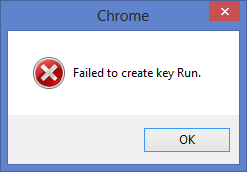
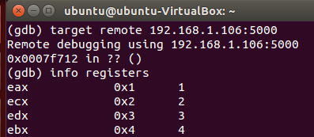

# Branch Monitoring Project

## Introduction

The Branch Monitoring Project.

### Goal
Branch Monitor is an alternative for runtime process monitoring on modern
(Windows) systems. Our approach makes use of Branch Trace Store (BTS) from
Intel's processors to implement a dynamic, transparent framework. The framework
provide many analysis facilities, such as function call tracing and Control Flow
Graph (CFG) reconstruction.

### Author

This project is part of Marcus Botacin's master work.
[Marcus](http://lasca.ic.unicamp.br/~marcus) is a Computer
Science master candidate at [Institute of Computing](http://www.ic.unicamp.br/) 
from [University of Campinas](http://www.unicamp.br/unicamp/), being advised 
by [Prof. Dr. Paulo Lício de Geus](http://www.lasca.ic.unicamp.br/paulo/) 
and [Prof. Dr. André Ricardo Abed Grégio](https://sites.google.com/site/argregio/). 
More detailed information, such as academic papers, can be found at the [project
page](https://sites.google.com/site/branchmonitoringproject/).

## Repository

From code to real world.

### Organization

The repository is organized as follows:

* **Client**: A simple polling-based driver client able to retrieve and print branch-collected data.
* **BranchClient**: An advanced driver client able to perform flow analysis and
  CG, CFG reconstruction for a given Process ID (PID). You are required to
  provide addresses for all libraries to be monitored.
* **Branch.Tester**: A loop program used for validation purposes.
* **Launcher**: A tool to ease monitoring process start up. Given a PID, dumps all
  memory address and supplies them as inputs to the advanced client.
* **BranchMonitor**: The monitoring driver (NMI handler).
* **BranchMonitor.2**: The monitoring driver (PMI handler).
* **DumpDLL**: A tool to ease introspection headers generation.
* **Transparency.Tests**: Tools to attest BranchMonitor's transparency.
* **ROP**: CFI verification tools to be used on execution traces.
* **Debugger**: A debugger built upon BranchMonitor framework.
* **Utils**: General utils for binary analysis using BranchMonitor.
* **PIN.Branch.Monitor**: A DBT-Based branch monitor implementation, used for comparative purposes.

### Versions

Currently, the *BranchMonitor* driver is available on two versions. The first is implemented using an NMI callback to handle interrupts whereas the second is implemented by hooking the performance handler to do so.

### Dependencies

* Compiled on [Visual Studio
  2012](https://msdn.microsoft.com/pt-br/library/dd831853%28v=vs.110%29.aspx).
* Binaries may require [MSVCR110D.dll](https://answers.microsoft.com/en-us/windows/forum/windows_8-winapps/the-program-cant-start-because-msvcr110dll-is/f052d325-3af9-4ae5-990b-b080799724db) when compiled using debugging symbols.
* The simple client requires [Python](https://www.python.org/) and
  [win32file](http://docs.activestate.com/activepython/2.6/pywin32/win32file.html).
* The advanced client requires [.Net
  framework](https://www.microsoft.com/net/download/framework).
* Code disassembly is performed by [Capstone](https://github.com/aquynh/capstone).
* Automatic launcher requires [Python](https://www.python.org/), [Sysinternals](https://technet.microsoft.com/en-us/sysinternals/bb545021.aspx), [BeautifulSoup](https://pypi.python.org/pypi/beautifulsoup4), [Codecs](https://docs.python.org/2/library/codecs.html), and [ConfigParser](https://docs.python.org/2/library/configparser.html).
* DLL dumps for *DumpDLL* are obtained using [DLL Export
  Viewer](http://www.nirsoft.net/utils/dll_export_viewer.html).
* The traces inputed to the *Divergence.Analysis* tool are aligned using the [Alignment library](https://pypi.python.org/pypi/alignment/1.0.9).

### Configuring

Some configurations, such as monitoring core, should be set on the config.h
file.

You should define wether you want debug messages to be displayed or not.
```C
#define DEBUG
```

In this case, you are also required to define the driver name printed on
debugger screen. This step is important so that you can filter driver messages
being displayed.
```C
#define DRIVER_NAME "[BRANCH-MONITOR]"
```

You also should set driver name for system and DOS subsystem. This is the name
you use to communicate using OpenFile.
```C
#define DRIVERNAME L"\\Device\\BranchMonitor"
#define DOSDRIVERNAME L"\\DosDevices\\BranchMonitor"
```

You should set on which core the monitor will be enabled.
```C
#define BTS_CORE 3
```
**Introspection Update**: As noticed by @smaresca, introspection headers are
version-dependent. The values supplied work for Windows 8 x64 6.2 build 9200. 
Some DLL versions are shown below whereas others can be found on 
[DLL.Versions](https://github.com/marcusbotacin/BranchMonitoringProject/blob/master/DumpDLL/DLL.Versions.txt).

```
ProductVersion   FileVersion      FileName                                                                             
--------------   -----------      --------                                                                             
6.2.9200.16384   6.2.9200.1638... C:\Windows\System32\ntdll.dll
6.2.9200.16384   6.2.9200.1638... C:\Windows\System32\kernel32.dll

```

In order
to run the solution on other systems, you need to dump the target DLL and generate
the header file. This process is eased by the *DumpDLL* tool, which parses DLL
dumps and produces the correct, ordered outputs, as shown below:

*NTDLL Input*:

```
==================================================
Function Name     : ZwYieldExecution
Address           : 0x0000000180003040
Relative Address  : 0x00003040
Ordinal           : 1971 (0x7b3)
Filename          : ntdll.dll
Full Path         : C:\Windows\system32\ntdll.dll
Type              : Exported Function
==================================================
```

*NTDLL Output*:
```
strcpy , 4896
strcat , 4720
memcmp , 4496
_local_unwind , 4432
RtlGetCurrentUmsThread , 4240
RtlEnterCriticalSection , 4192
RtlLeaveCriticalSection , 4112
```


### Building

In order to build the many components of our framework, you should include their
paths on the compilation project, as shown below:


In my computer, I was compiling under C:\\. If you are compiling from other dir,
you need to point /src path properly.

To make the *BranchClient* compilation easier, I included the
*capstone-3.0.4-win64* on the repository.

You should also define system architecture and configurations, as shown below:


## Running

All required steps for the win!

### Driver Installation

As our driver is not signed, you should [disable driver sign enforcement](https://www.howtogeek.com/167723/how-to-disable-driver-signature-verification-on-64-bit-windows-8.1-so-that-you-can-install-unsigned-drivers/) in order
to use it.

After installing it, you can load it using services manager, as shown below:


### Testing

In order to check if the solution is properly working, you can use the simple
client to retrieve branch data, as shown below:


### Following the Flow

In order to filter process actions and perform analysis tasks, such as
disassembling, you have to start the advanced client with the
binary's and libraries' address, as shown below:


In order to ease this process, the *Launcher* is able to perform the task of
retrieving address information and launching the client, as you can see below:


After its startup, the client is already working, as shown below:


#### Examples

The *BranchClient\examples* directory contains some trace examples obtained from real malware samples. I hope they could clarify BranchMonitor's role on binary monitoring. Some identified actions are shown below:

```
LIB C:\Windows\SysWOW64\user32.dll at 74c68038 (GetCursorPos+0x12) returned to Binary avr.exe at 465806
```

```
LIB C:\Windows\SysWOW64\user32.dll at 76489ddc (IsWindowVisible+0x38) returned to Binary Chrome.exe at 4c52a5
```

In such cases, these functions were used to display the following message:

)

#### Transparency

One of biggest advantages of using BranchMonitor is the provided transparency. In order to verify such claim, you can use the checks from the *Transparency.Tests* directory. My intention is not to provide an exhaustive list of *anti-dbg* techniques, but some transparency insights instead. 

Currently implemented tests:

* *IsDebuggerPresent*
* *CheckRemoteDebugger*
* *OutputDebugString*

For more information about anti-analysis tricks, check [this](https://github.com/marcusbotacin/Anti.Analysis).

### Debugging

You can check debug messages if the driver was compiled using the DEBUG flag, as shown:

```C
	#define DEBUG
```

The debug messages are printed on a debug screen. The following figure shows the messages being printed on DbgView, from SysInternals.


## Applications

Applications build upon the developed framework.

### Debugger

A debugger built upon BranchMonitor framework. The directory is organized as follows:

* **GDB**: A GDB stub which can be used to control the BranchMonitor debugger. On the original article, it was integrated into the debugger solution itself, but I released here an standalone version, so people can use it on distinct applications. It is totally based on [mseaborn's gdb-debug-stub](https://github.com/mseaborn/gdb-debug-stub).
* **Driver**: To be released.

#### GDB Usage

The GDB stub is available by setting the *remote target* on the GDB client, as shown below:



More information is coming soon.

### ROP Detector

As a result of BranchMonitoring framework, some Control Flow Integrity (CFI) policies for ROP attack detection were implemented. You can find on the *ROP* directory implementations for the *CALL-RET* and the *Gadget-Size* policies. Although I have previously described on an article a real-time solution, the hereby published tools are intended for post-analysis. However, you can easily implement these algorithms on the *DriverClient*, since the traces were retrieved from the tool.

The *CALL-RET* policy consists on matching pairs of *CALLs* and *RETs*, based on the idea of each *RET* must be preceed by a *CALL* on an integer flow. This policy is shown below:

```
('CURRENT STACK ', [['call', 'NewToy', 'printf']])
('CURRENT STACK ', [['call', 'NewToy', 'printf'], ['call', 'printf', '__iob_func']])
('CURRENT STACK ', [['call', 'NewToy', 'printf'], ['call', 'printf', '__iob_func'], ['ret', '__iob_func', 'printf']])
CALL-RET MATCH, REMOVING
...
('CURRENT STACK ', [['call', 'NewToy', 'printf']])
('CURRENT STACK ', [['call', 'NewToy', 'printf'], ['ret', 'printf', 'NewToy']])
CALL-RET MATCH, REMOVING
('CURRENT STACK ', [])
```

The gadget size policy is a heuristic which assumes ROP gadgets are smaller than ordinary ones, so a moving window is used to register the execution of a given number of small gadgets, as shown below:

```
('Detected in', [2, 17, 36, 4, 2, 27, 13, 5, 46, 2])
```

### Anti-Analysis Tricks Detection

Given the transparency characteristic, our framework is able to execute anti-analysis tricks without any problem. It allows us to perform pattern matching searches for evasion attempts and other tricks. By using [these detectors](https://github.com/marcusbotacin/Anti.Analysis), I was able to detect some of them, shown below:

Fake Conditional Jump:
```
4001b: xor    %eax,%eax
4001d: jne    4000 <main>
4001f: pop    %rbp
```

CPU Comparison:
```
4400:   push   %rbp
4401:   str    0x0(%ebp)
4406:   mov    %rsp,%rbp
4409:   mov    $0x0,%edi
440e:   callq  44013 <main+0x13>
```

### Divergence Analysis

One can also use our transparent tracer as a groundtruth for evaluating the way a binary executes inside another tracing tool. The tool under the *Utils/Divergence.Analysis* is suited for this task. A divergence example is shown below:

```
0x01 | 0x01
0x02 | 0x02
    / \
---- | 0x41
0x03 | 0x42
    \ /
0x05 | 0x05
0x06 | 0x06
```
The aforementioned tricks were also detected by inspecting the instruction block placed right before a divergent branch instruction.

## Utils

The *Utils* directory contains some tools and utilities for binary analysis using BranchMonitor. Currently, the following tools are available:

* **PrintFunc**: A simple script for printing the functions called on a given trace
* **ManualDisasm**: A [pybfd](https://github.com/Groundworkstech/pybfd)-based solution for disasming small bytes.

### PrintFunc

This utility should be used as follows:

```
Usage: python PrintFunc.py <trace> --remove-offsets

```

The called functions can be printed considering or not their offsets, as shown below:

*Considering Offsets*:
```
LdrShutdownProcess+0x256
LdrShutdownProcess+0x2b7
RtlExitUserProcess+0xac
```

*Discarding Offsets*:
```
LdrShutdownProcess
LdrShutdownProcess
RtlExitUserProcess
```

You can filter the output in order to increase your analysis power. The following example shows function calls being counted.

*Counting command*:

```
python PrintFunc.py $1 $2 | sort | uniq -c | sort -gr
```
*Command Output*:

```
56 printf
12 WriteFile
10 TerminateThread
2 ExitProcess
```

### ManualDisasm

A tool to disasm small pieces of code from trace-retrieved data. 

*Usage Example*:

```
Usage: python ManualDisasm.py <trace> <addr>
```

Example Considering the following trace excerpt:

```
should disasm from 444417 to 444427
\x8b\x45\xf0\x3b\xc7\x74\x11\x8d\x4d\xf0\x51\x8b\x4d\x08\x48\x50
```

*Command Example*:

```
python ManualDisasm.py "\x8b\x45\xf0\x3b\xc7\x74\x11\x8d\x4d\xf0\x51\x8b\x4d\x08\x48\x50" 0
```
*Command Output*:

```
0x4 (size=1)	 pop    rsp
0x5 (size=2)	 js     0x000000000000003b
0x7 (size=5)	 xor    eax,0x3066785c
0xC (size=1)	 pop    rsp
0xD (size=2)	 js     0x0000000000000042
```

## Comparing BranchMonitor with other solutions

Always as possible, I try to compare BranchMonitor with other solutions,
either for validation or evaluation. For such purpose, I present here a
Dynamic Binary Translation (DBT) tool, implemented on [Intel
PIN](https://software.intel.com/en-us/articles/pin-a-dynamic-binary-instrumentation-tool).
The tool directory, *PIN.Branch.Monitor*, is organized as follows:

* *Windows*: Instrumentation code to be run on Windows.
* *Linux*: Instrumentation code to be run on Linux.
* *Comparison*: Comparison results between PIN tool and BranchMonitor.

As this tool is implemented as an instrumentation code, it can be run on
Linux or Windows. The small differences between the two versions are
function or type names.

The *Comparison* directory presents the results from running the
*Branch.Tester* code on BranchMonitor and the PIN tool. As can be
noticed on the example above, the results are similar.

*PIN Result*:

```
From: 0000000077332F89 To: 0x7732ec90 Disasm of 1 instr: call
From: 000000007732EC97 To: 0x7732ecab Disasm of 1 instr: jnz
Disasm of 0x7 bytes from 000000007732EC90: 0x48 0x3b 0xd 0x39 0x8e 0xe 0x0
```

*BranchMonitor Result*:

```
Binary C:\BranchMonitoringProject\Branch.Tester\x64\Debug\Branch.Tester.exe at <0x1ca1> to Binary C:\BranchMonitoringProject\Branch.Tester\x64\Debug\Branch.Tester.exe at <0x1c90>
Binary C:\BranchMonitoringProject\Branch.Tester\x64\Debug\Branch.Tester.exe at <0x1c96> to Binary C:\BranchMonitoringProject\Branch.Tester\x64\Debug\Branch.Tester.exe at <0x1c9a>
should disasm from 7ff6d6ec1c90 to 7ff6d6ec1c96
```

On both cases, the same number of bytes were considered on the execution trace.

## Open Implementation Issues

I am performing some code clean up before publishing the final solution. This
way, some features are not available yet. I plan to release such features as
soon as possible. 

## Limitations

This framework is presented as a *proof-of-concept* (PoC) of the branch monitoring capabilities, thus some limitations exists, such as:

* **Single Core Analysis**: The branch mechanism should be extended to operate
  on multicore systems.
* **I/O Limitation**: Currently, I/O is performed by polling. The driver should
  be extended to support IOCTLs.
* **Debug**:
	* Debug messages are currently implemented as functions. Macros should be used instead. 
	* Debug is enabled using #defines. A dynamic control mechanism should be
	  implemented.
	* Debug messages are printed on every function. We need verbosity
	  control.
* **CPU Checks**: PERF_COUNT support check is missing.
* **BranchClient Multi-Thread Support**: How to launch more threads without
  breaking flow tracking ?

## Other Research Using BranchMonitor

* [Malware Variants Identification](https://github.com/marcusbotacin/Malware.Variants)

## Future Plans

* Multi-Core implementation is coming!
* Linux version is coming!

## Contributions

I really would like to receive your contributions. By now, a non-exhaustive list of possible contributions:

* *Implementing missing features*: See *Limitations* section.
* *Solving TO-DOs*: Lots of improvements along the code.
* *Replacing insecure functions*: Remove all *strcpy* and *shell=True* from the code.
* *Add new Utils*: The more analysis tools the better!

## Publications

I hope I could provide the community all details regarding branch monitoring on a near future.

## Media

Check out our [Youtube playlist](https://www.youtube.com/watch?v=BguVzqMt_j0&list=PLVYZ2jULLUDvqFVpU3pCZGlY9gCzYoyXP).

## Mentions to the BranchMonitoring project

It is always great to have you efforts acknowledged, so I present here some mentions to this work:

* [Capstone Site](http://www.capstone-engine.org/showcase.html)
* [Reddit Topic](https://www.reddit.com/r/ReverseEngineering/comments/5ycg08/code_tracing_framework_based_on_intel_branch/)

Please tell me if you are using/referring this project.
